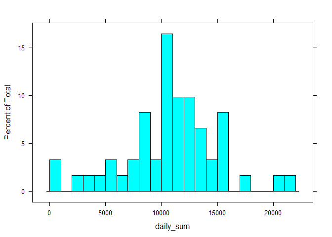
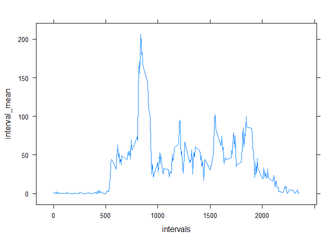
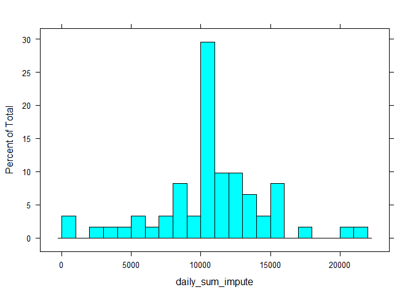
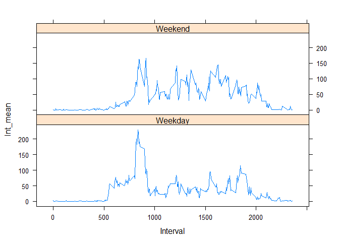

# Reproducible Research: Peer Assessment 1


## Loading and preprocessing the data
As with any R coding project, load the data.
Put file in same directory as .Rmd file so that setting the working directory
is unnecessary.

```r
dta <- read.csv("activity.csv")
```


## What is mean total number of steps taken per day?
The tapply function is sufficient to sum steps by date. For this portion of the
assignment, we can simply ignore NA values.  
We first plot a histogram to explore the data briefly, then we calculate the 
the mean and median of the the daily total steps.  
We see that the mean and median are very similar in value.

```r
library(lattice)
daily_sum <- with(dta, tapply(steps, date, sum))
histogram(daily_sum, type = "percent", breaks = seq(0, 22000, by = 1000))
```

 

```r
mean(daily_sum, na.rm = TRUE)
```

```
## [1] 10766.19
```

```r
median(daily_sum, na.rm = TRUE)
```

```
## [1] 10765
```

## What is the average daily activity pattern?
A time-series line graph is a good way to explore the daily activity pattern of 
the user. After another tapply() call, we have the average for each interval 
with NAs one again ignored. Graphing these values shows very little night 
activity followed by a spike in the morning, then fairly steady activity 
throughout the rest of the day. For this person, the maximum steps occurs in the
middle of the 8 o'clock hour, which is found by creating a matrix and subsetting 
it.

```r
interval_mean <- tapply(dta$steps, dta$interval, mean, na.rm=TRUE)
intervals <- unique(dta$interval) # create vector of intervals
xyplot(interval_mean~intervals, type = "l")
```

 

```r
df <- cbind(intervals, interval_mean)
subset(df, df[,2] == max(df[,2]))[,1]
```

```
## [1] 835
```


## Imputing missing values
We first get the sum of NAs in the dataset and realize there is a substantial
amount, and ignoring them might be leading to the wrong conclusions in our
results so far. A function is written to impute the missing data with the mean
from each interval. We then make another histogram and mean/median calculations 
then compare these to the previous one. This is imperfect as it seems that only
whole days are missing, and all it effectively does is increase the number of
days with total steps equal to the mean. The histogram peak gets taller.

```r
sum(is.na(dta$steps))
```

```
## [1] 2304
```

```r
my_impute <- function(my_data) {
      impute_data <- my_data[!is.na(my_data$steps),]
      interval <- unique(impute_data$interval)
      int_means <- tapply(impute_data$steps, impute_data$interval, mean)
      lkup_table <- cbind(interval, int_means)
      for(i in 1:length(my_data$steps)){
            if(is.na(my_data$steps[i])) {
                  my_data$steps[i] <- lkup_table[lkup_table[,1] == my_data$interval[i]][2]
            }
      }
      return(my_data)
}

imputed_data <- my_impute(dta)
daily_sum_impute <- with(imputed_data, tapply(steps, date, sum))
histogram(daily_sum_impute, type = "percent", breaks = seq(0, 22000, by = 1000))
```

 

```r
mean(daily_sum_impute, na.rm = TRUE)
```

```
## [1] 10766.19
```

```r
median(daily_sum_impute, na.rm = TRUE)
```

```
## [1] 10766.19
```

## Are there differences in activity patterns between weekdays and weekends?
To investigate any differences between weekdays and weekends, a function is 
written that groups the days of the week into their constituent part of the
week. This is then added to original data frame. The tapply function is employed
with two factors, and the tidyr package gather function is used to make weekday/
weekend a categorical variable in it's own column again. This allows us to use 
lattice's xyplot function to make the side by side graph of the two. The data
does seem to suggest difference in step patterns during the week and weekend for 
this subject. Steps are takend more evenly throughout the day during the 
weekend.

```r
get_weekpart <- function(imputed_data){
      library(tidyr)
      dayofweek <- weekdays(as.Date(imputed_data$date, "%Y-%m-%d"))
      weekpart <- NULL
      for(i in 1:length(dayofweek)){
            if(dayofweek[i] == "Monday" || dayofweek[i] == "Tuesday" || 
                     dayofweek[i] == "Wednesday" || dayofweek[i] == "Thursday" ||
                     dayofweek[i] == "Friday"){
                  weekpart[i] <- "Weekday"
            } else {
                  weekpart[i] <- "Weekend"
            }
      }
      imputed_data <- cbind(imputed_data, weekpart)
      wk_int_mean <- with(imputed_data, tapply(steps, list(interval, weekpart),
                                               mean))
      wk_int_mean <- cbind(unique(imputed_data$interval), wk_int_mean)
      wk_int_mean <- as.data.frame(wk_int_mean)
      names(wk_int_mean)[1] <- "Interval"
      wk_int_mean_rearranged <- gather(wk_int_mean, PartOfWeek, Int_mean, 
                                       -Interval)
      return(wk_int_mean_rearranged)
}
weekpart_data <- get_weekpart(imputed_data)
with(weekpart_data, xyplot(Int_mean~Interval|PartOfWeek, type = "l",
                           layout=c(1,2)))
```

 


